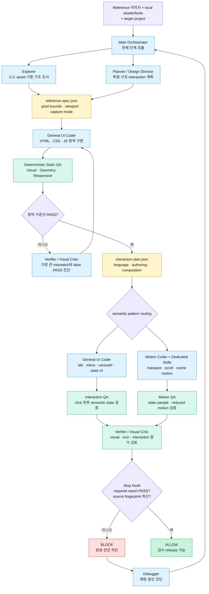

# 레퍼런스 퍼블리싱 자동화 V1

정적 시안을 픽셀 좌표계로 측정하고 Chromium 결과와 비교하는 로컬 우선 퍼블리싱 워크플로다. 시안은 재설계 대상이 아니라 구현해야 할 웹 인터페이스 상태로 취급한다.

## 작동 원리와 역할 구조



Main은 순서와 범위를 조율하고, 에이전트 역할은 계획·구현·비평·진단을 나눠 맡는다. 실제 PASS/FAIL은 LLM의 주관적 선언이 아니라 Node/Playwright 기반 QA report와 현재 source fingerprint를 Stop Hook이 확인해 결정한다. FAIL 또는 stale evidence가 있으면 완료가 차단되고 해당 구현 단계로 돌아간다.

## 기본 흐름

1. `npm run qa:measure -- --reference <reference.png> --output work/reference-measurement.json`으로 원본을 측정한다.
2. `npm run qa:spec -- --reference <reference.png> --capture-mode viewport|fullPage --viewport-width 1440 --viewport-height 900 --output work/reference-spec.json`으로 좌표·뷰포트·캡처 계약을 만든다.
3. 정적 화면을 먼저 맞춘다. 긴 시안은 문서 높이이며 뷰포트 높이가 아니다.
4. 정적 기준선이 안정되면 상호작용 후보를 발견하고 단일 SSOT인 `work/interaction-plan.json`을 검토한다.
5. Visual, Interaction, Motion, Geometry, Responsive QA를 필요한 범위에서 실행한다.
6. `--set-latest`로 선택한 QA 실행을 Stop Hook의 완료 기준으로 지정한다.

```powershell
npm run qa:interaction-plan -- --url http://127.0.0.1:3000/ --mode reference --output work/interaction-plan.json
npm run qa:interaction-plan:validate -- --validate work/interaction-plan.json
npm run qa -- --reference reference.png --url http://127.0.0.1:3000/ --capture-mode fullPage --width 1440 --height 900 --output qa --interaction-plan work/interaction-plan.json --require-motion --require-geometry --require-responsive --set-latest
npm run qa:interaction -- --url http://127.0.0.1:3000/ --plan work/interaction-plan.json --output qa/interaction-report.json
npm run qa:motion -- --url http://127.0.0.1:3000/ --plan work/interaction-plan.json --output qa/motion-report.json
npm run qa:geometry -- --spec work/reference-spec.json --url http://127.0.0.1:3000/ --output qa/geometry-report.json
npm run qa:responsive -- --url http://127.0.0.1:3000/ --output qa/responsive-report.json
```

## 상호작용 분류와 라우팅

`tools/interaction-patterns.mjs`가 패턴 분류, 레시피, 전담 검증기, 자동화 상태의 단일 레지스트리다. Interaction Plan, Interaction QA, Motion QA가 모두 이 레지스트리를 사용한다.

- `STATE_INTERACTION`: 탭, 아코디언, 드로어, 메뉴, 캐러셀처럼 클릭 후 의미 상태가 바뀌는 패턴
- `POINTER_INTERACTION`: hover reveal, pointer reactive, cursor tooltip처럼 포인터 입력에 반응하는 패턴
- `CONTINUOUS_MOTION`: marquee, ticker, loop처럼 시간에 따라 계속 움직이는 패턴
- `SCROLL_MOTION`: reveal, pin/scrub, scene transition, split text, horizontal pin처럼 스크롤 진행률에 결합된 패턴
- `ADVANCED`: canvas/WebGL처럼 현재 자동 검증 범위를 벗어난 패턴

상태 상호작용은 Interaction QA가 실제 상태 전이를 검사한다. dropdown/menu-state는 명시된 control·panel·dismiss 계약을 사용하며 class 변화만으로 PASS하지 않는다. 모션 후보는 클릭 폴백을 사용하지 않고 Motion QA로 이관한다. `pin-scrub-track`, `scene-transition`, `split-text-reveal`, `horizontal-pin-scroll`은 각 recipe의 `verification.expectedStates`와 전용 semantic verifier를 사용하고, transform 변화만으로 PASS하지 않는다. 검증 계약이 부족한 모션은 `DEFERRED`, 현재 범위 밖 패턴은 `UNSUPPORTED`로 기록하며 자동 PASS로 바꾸지 않는다. 상세 매핑은 `docs/interaction-corpus.md`에 있다.

## 두 가지 설계 모드

- `reference`: 시안 상태, 소스 주석, 명확한 DOM affordance가 근거다. HIGH는 구현·검증하고, MEDIUM은 보수적으로 구현하며, LOW 추정은 `skip`한다.
- `design`: 페이지 전체 motion language를 먼저 정의한다. 성격, 속도, 선호/금지 family, section entry 변주, pointer/continuous/scroll 사용 원칙이 모두 필요하다.

시각적 장식만 보고 기능을 발명하지 않는다. 새 페이지는 필요 시 `html { font-size: 62.5%; }`로 `1rem = 10px` 규칙을 사용할 수 있지만, 레퍼런스 및 브라우저 측정 좌표는 px를 유지한다.

## 두 개의 핵심 계약

- `work/reference-spec.json`: reference pixel dimensions, viewport, `captureMode`, section/major element bounds, typography 기대값을 가진다. source/Figma/PSD bounds를 우선하고 PNG만 있으면 deterministic measurement를 사용한다.
- `work/interaction-plan.json`: interaction candidate의 id, selector, semanticType, evidence, provenance, confidence, implementation, recipe, requiredStates, responsive/reduced-motion 동작과 verification을 가진 유일한 SSOT다.
- Interaction authoring: discovery 뒤 `interactionLanguage`, `actionableAuthoring`, candidate별 `authoring`, `interactionComposition`을 생성한다. 순서는 semantic type → intent → interaction family → primitive이며, `required-baseline`, `affordance-driven`, `enhanced-motion` 정책을 분리한다. `coverage.actionable`의 모든 selector는 actionable authoring group에 연결되어야 한다. Behavior authoring(클릭 후 상태 변화)과 feedback authoring(hover/focus/active primitive)을 분리한다. Corpus는 효과 복제 목록이 아니라 재사용 가능한 interaction vocabulary다.
- Primitive selection은 recipe의 고정 효과를 복사하지 않고 visual language의 line/shape/image/density/contrast 관찰값과 primitive 후보군을 조합해 결정하며 rationale을 남긴다. Anti-generic validator는 3개 이상 semantic group의 단일 primitive 반복, 80% 이상 opacity-only, generic translateY/card-lift 반복, image/card 전체 generic scale, 근거 없는 decorative arrow를 FAIL 처리한다. 작은 1~2 group 페이지의 동일 primitive는 허용한다.
- `interactionComposition`은 `primary`, `secondary`, `continuous`, `restraint` 네 역할을 가진다. stateful affordance가 있는데 primary가 비어 있거나 continuous motion만 남으면 plan을 거부한다. REFERENCE_MODE enhanced-motion은 evidence가 없으면 `implementation: "skip"`만 허용하고, DESIGN_MODE는 motionLanguage의 preferred/banned family와 pointer/continuous/scroll/pace/character 제약을 실제 selection에 사용한다.

## Skill 계층

- primitive: 탭/아코디언 상태, 기본 hover/focus, progress sampling처럼 작은 공통 단위
- shared recipe: drawer, dropdown, hover reveal, scroll reveal, parallax처럼 공통 계약으로 충분한 패턴
- Dedicated Skill: 상태 동기화나 DOM·responsive·접근성 함정이 큰 `carousel-state`, `marquee`, `pin-scrub-track`, `scene-transition`, `split-text-reveal`, `horizontal-pin-scroll`
- deferred/unsupported: 자동 검증 계약이 없거나 canvas/WebGL처럼 현재 범위 밖인 패턴

## QA와 최신성

- Visual QA: dimension, 실제 mismatch mask, mismatch ratio와 큰 region을 함께 판정하고 `actual.png`, `diff.png`, `overlay.png`, `mask.png`, `report.json`을 만든다.
- Interaction QA: state candidate를 실제 클릭/hover하고 before/after semantic state와 carousel projection 동기화를 검사한다. interaction plan이 선택되면 visible actionable element inventory도 함께 검사해 hover feedback, keyboard focus-visible feedback, perceptible feedback, native 또는 검증된 click behavior가 빠진 control을 selector와 failure reason으로 기록한다.
- Motion QA: marquee 구조와 reduced motion을 검사하고, shared scroll recipe는 0/0.25/0.5/0.75/1 sample을 사용한다. Dedicated recipe는 pin 도달/해제, active scene 전환, 접근 가능한 원문·font·responsive text, track distance/mobile fallback을 각각 확인하며 required state coverage와 runtime error를 report에 남긴다.
- Geometry QA: 레퍼런스 좌표와 `getBoundingClientRect()`를 비교해 `dx/dy/dw/dh`를 기록한다.
- Responsive QA: 1024×768 및 390×844에서 overflow, 잘림, 중복 instance, 숨겨진 branch animation, hover-only 핵심 정보 등을 점검한다.

Visual, Interaction, Motion, Geometry, Responsive 보고서는 소스 지문을 가진다. 외부 target을 검수할 때는 모든 명령에 `--source-root <target-project>`를 명시하고, `--set-latest`는 그 target의 canonical QA output을 가리키게 한다. Stop Hook은 canonical source root가 일치하는지, 필요한 보고서가 PASS인지, actionable coverage가 통과했는지, 현재 소스와 지문이 일치하는지를 검사한다. 의도적인 marquee/scene clipping은 target DOM에 `data-qa-allow-clipping`을 명시해야 하며 Responsive report의 `allowedClipping`에 기록된다. `qa/`, `qa-*`, `qa_*`, `qa.*` 같은 최상위 QA 산출물 루트만 지문에서 제외하며 `qaSomething/` 같은 실제 소스 폴더는 제외하지 않는다.

### Actionable coverage와 perceptibility

interaction plan의 `coverage.actionable`은 명확하게 검출되는 `a`, `button`, `role=tab`, `summary`, `aria-expanded`, next/prev control만 대상으로 한다. hover는 pointer 이동 전후의 computed style, focus는 keyboard 경로와 `:focus-visible`, click은 native navigation/submit·명시적 handler·interaction candidate 중 하나의 근거를 요구한다. 실제 상태 변화는 Interaction QA가 별도로 click 전후 semantic state와 panel/projection을 확인하므로 범용 자동화 엔진으로 추측하지 않는다.

## Local-first와 단위

기존 project library → 기존 helper → 이미 설치된 package → 필요한 local npm install 순서로 사용한다. GSAP, Swiper, Google Fonts 같은 CDN을 자동 추가하지 않는다. 신규 페이지는 `html { font-size: 62.5%; }`를 사용할 수 있고 spacing/typography/radius/motion distance는 rem을 우선한다. screenshot/reference/runtime measurement와 1px hairline은 px를 유지한다.

## 프로젝트 에이전트

`.codex/config.toml`과 `.codex/agents/*.toml`은 Codex가 공식 지원하는 프로젝트 custom agent 설정을 사용한다. 역할은 기획/디자인 디렉터, 검증/비주얼 크리틱, 일반 UI 코더, 모션 코더, 디버거, 탐색기로 분리한다. QA 도구 자체는 결정적 Node/Playwright 프로그램이며 LLM을 사용하지 않는다. 모델 배정과 쓰기 권한은 `docs/agent-roles.md`에 정리되어 있다.

## Stop Hook

소스를 바꾼 뒤 완료 선언 전에 관련 QA를 다시 실행한다. Hook이 활성화되지 않았다면 Codex 앱에서 프로젝트를 다시 열고 프로젝트 Hook을 신뢰/활성화한 다음 `npm test` 또는 `node .codex/hooks/stop-reference-publish.mjs`로 smoke test를 한다. Hook은 객관적 증거만 판정하며 어떤 효과를 선택할지는 결정하지 않는다.

## 테스트

```powershell
npm test
```

syntax/config, Visual QA, reference/geometry/responsive workflow, interaction/motion contract, Stop Hook을 순서대로 실행한다. 테스트를 느슨하게 바꿔 PASS를 만들지 않고 실제 state·motion sample·freshness를 검증한다.
