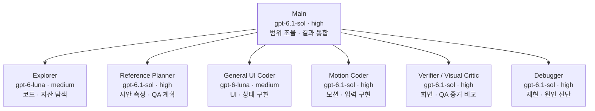

# Codex 프로젝트 에이전트 역할

[전체 작업 흐름도](../README.md#한눈에-보는-조직도) · [스킬·QA·Hook 구성](structure.md)

프로젝트 설정은 `.codex/config.toml`, 역할별 정의는 `.codex/agents/*.toml`에 둔다. 필요하고 위임이 허용된 작업에서만 사용하며 모든 작업에 역할별 에이전트를 생성하라는 요구가 아니다. 글로벌 설정이나 이미 실행 중인 세션을 소급 변경하지 않는다.

기존 **Planner / Design Director**는 제거했다. 신규 디자인의 기본 진입점은 `frontend-experience`이며, 설치된 Build Web Apps의 `frontend-app-builder`를 사용할 수 있다. 아래 Reference Planner는 제공 시안의 측정·QA 계획만 담당한다.

## 필요할 때 선택하는 역할

Main이 요청과 작업 범위를 정하고 결과를 통합한다. 아래 6개 역할은 필요하고 위임이 허용된 경우에만 선택한다. 스킬은 작업 지침이며 QA는 Node/Playwright 도구로, 에이전트와는 별개다.

| 역할 | 모델 | 추론 강도 | 기본 권한 |
|---|---|---:|---|
| Main | gpt-6.1-sol | high | 현재 세션 권한 |
| Reference Planner | gpt-6.1-sol | high | read-only |
| Verifier / Visual Critic | gpt-6.1-sol | high | read-only |
| General UI Coder | gpt-6-luna | medium | workspace-write |
| Motion Coder | gpt-6.1-sol | high | workspace-write |
| Debugger | gpt-6.1-sol | high | read-only |
| Explorer | gpt-6-luna | medium | read-only |

Reference Planner는 측정과 QA 계약을, Verifier는 콘셉트/실제 화면 비교와 시각/의미 증거를, Coder는 명시된 범위의 구현을, Debugger는 재현과 원인 진단을, Explorer는 읽기 전용 탐색을 담당한다. 같은 파일을 동시에 쓰는 역할은 만들지 않는다. Visual/Interaction/Motion/Geometry/Responsive QA는 Node/Playwright 도구이며 LLM 모델을 사용하지 않는다.

모델 확인일은 **2026-10-07**이다. Main·계획·검수·모션·진단은 최신 Sol인 `gpt-6.1-sol`, 범위가 정해진 UI 구현과 읽기 전용 탐색은 `gpt-6-luna`를 선택했다. 추론 강도는 기존 high/medium을 유지한다. 역할을 지정하지 않은 서브에이전트의 기본값은 `gpt-6.1-sol` / `medium`이다. 이 배정은 작업 범위와 속도를 고려한 프로젝트 선택이며, 역할별 모델 실행 성능을 비교한 결과는 아니다.

형식과 필드는 OpenAI의 [Codex Subagents 문서](https://learn.chatgpt.com/docs/agent-configuration/subagents)를 따른다. 모델 ID와 지원 추론 강도는 [GPT-6.1 Sol](https://developers.openai.com/api/docs/models/gpt-6.1-sol), [GPT-6 Luna](https://developers.openai.com/api/docs/models/gpt-6-luna)를 확인했고, Codex 제공 여부는 [공식 변경 소식](https://learn.chatgpt.com/docs/changelog)과 현재 호출 환경의 지원 모델 목록을 대조했다. 다른 환경의 제공 여부는 계정·클라이언트·워크스페이스 설정에 따라 확인한다.
