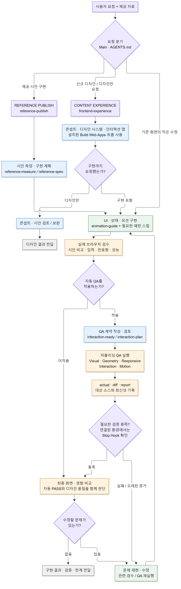

# 저장소 구조와 연결도

[README의 전체 흐름도](../README.md#한눈에-보는-조직도) · [역할별 모델·권한](agent-roles.md)

## 구성별 역할

| 구성 | 위치 | 역할 |
|---|---|---|
| 프로젝트 지침 | [AGENTS.md](../AGENTS.md) | 요청에 맞는 진입점과 디자인·검증 기준 |
| 에이전트 설정 | [.codex/config.toml](../.codex/config.toml), `.codex/agents/` | Main 설정과 선택적으로 사용할 6개 역할 |
| 스킬 11개 | `.agents/skills/` | 디자인·퍼블리싱·모션·QA 작업 지침 |
| QA 도구 | `tools/`, [package.json](../package.json) | Node/Playwright로 실행하는 측정·브라우저 검사 |
| Stop Hook | [.codex/hooks.json](../.codex/hooks.json) | 연결된 환경에서 Stop 시 완료 gate 실행 |
| 동작 테스트 | `tests/` | 도구·계약·Hook의 회귀 검사 |

## 작업 흐름

사각형은 작업 단계, 마름모는 요청·검증에 따른 분기다. 문제가 발견되면 구현 단계로 돌아가 수정하고 관련 검수를 반복한다.



[Mermaid 원본](diagrams/workflow.mmd) · [SVG 확대 보기](diagrams/workflow.svg)

새 디자인의 콘셉트와 인터랙션 맵은 구현 **전**에 만든다. 구현 후의 `interaction-plan.json`은 자동 QA 계약이다. `design` 모드는 앞서 작성한 `motion-language.json`을 전달받는다.

브라우저 검수는 자동 QA와 함께 수행한다. Canvas/WebGL 등 자동 검사 범위 밖의 경험은 직접 확인하며, 자동 PASS를 디자인 품질의 보증으로 취급하지 않는다. Stop Hook은 기존 퍼블리싱 완료 gate이고, 이 문서를 추가한다고 새 환경에 자동 설치되지는 않는다.

## 스킬 찾아보기

| 묶음 | 스킬 | 사용할 때 |
|---|---|---|
| 디자인 | [frontend-experience](../.agents/skills/frontend-experience/SKILL.md) | 새 사이트·리디자인의 콘셉트와 인터랙션 설계 |
| 퍼블리싱 | [reference-publish](../.agents/skills/reference-publish/SKILL.md) | 제공된 시안을 충실히 구현 |
| QA 조율 | [interaction-ready](../.agents/skills/interaction-ready/SKILL.md) | QA 계약·패턴 검증·완료 gate 연결 |
| QA 계약 | [interaction-plan](../.agents/skills/interaction-plan/SKILL.md) | DOM selector와 상태·증거·검증 경로 연결 |
| 모션 공통 | [animation-guide](../.agents/skills/animation-guide/SKILL.md) | 입력·반응형·움직임 감소·성능을 유지한 모션 구현 |
| 모션 패턴 | [carousel-state](../.agents/skills/carousel-state/SKILL.md) | 캐러셀 상태와 투영 검증 |
| 모션 패턴 | [marquee](../.agents/skills/marquee/SKILL.md) | 연속 흐름 |
| 모션 패턴 | [pin-scrub-track](../.agents/skills/pin-scrub-track/SKILL.md) | 고정 구간과 스크롤 진행 연결 |
| 모션 패턴 | [scene-transition](../.agents/skills/scene-transition/SKILL.md) | 장면 전환 |
| 모션 패턴 | [split-text-reveal](../.agents/skills/split-text-reveal/SKILL.md) | 분할 텍스트 등장 |
| 모션 패턴 | [horizontal-pin-scroll](../.agents/skills/horizontal-pin-scroll/SKILL.md) | 가로 이동과 스크롤 고정 |

프로세스 페이지와 모션·입력 기준은 `frontend-experience` 안의 [process-pages.md](../.agents/skills/frontend-experience/references/process-pages.md), [motion-and-input.md](../.agents/skills/frontend-experience/references/motion-and-input.md)를 따른다. 별도 에이전트나 별도 스킬은 아니다. 패턴과 도구의 자세한 대응은 [interaction-corpus.md](interaction-corpus.md)에 있다.

## 폴더 지도

```text
skills-hooks/
├─ AGENTS.md                      요청 분기와 공통 작업 기준
├─ README.md                      시작점과 전체 작업 흐름도
├─ .codex/
│  ├─ config.toml                 프로젝트 모델·에이전트 설정
│  ├─ agents/                     선택 가능한 6개 역할 정의
│  ├─ hooks.json                  Stop 이벤트 연결 설정
│  └─ hooks/
│     └─ stop-reference-publish.mjs   QA 보고서와 소스 최신성 검사
├─ .agents/skills/                위 표의 11개 스킬
│  ├─ frontend-experience/
│  │  └─ references/              프로세스 페이지 · 모션/입력 기준
│  └─ reference-publish/
│     └─ references/              퍼블리싱 프로젝트 규칙
├─ tools/                        측정 · QA 계약 · 브라우저 검사
├─ tests/                        동작 테스트와 HTML fixtures
├─ docs/
│  ├─ structure.md                현재 문서: 구조와 연결도
│  ├─ agent-roles.md              역할별 모델·권한·책임
│  ├─ interaction-corpus.md       패턴 레지스트리와 검증 계약
│  └─ diagrams/                   Mermaid 원본 · PNG · SVG
└─ package.json                  QA·테스트 명령과 의존성
```

`work/`의 계획 파일과 `qa/`의 캡처·보고서는 실행 산출물이다. 외부 프로젝트의 QA는 해당 대상 경로와 `--source-root`를 사용한다. 동일한 파일을 여러 역할이 동시에 수정하지 않는다.
